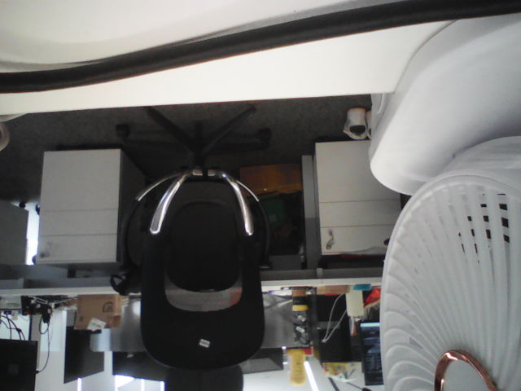
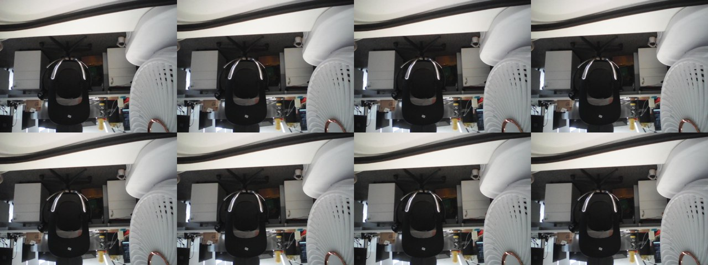

> **2026-08-18 最终策略更新：** 本文中“仅软件 JPEG”“480x480 多帧失败”以及“硬件 JPEG 普遍不可用”的段落是修复前的历史测量。当前固件在 480x480/640x480 使用完整熵校验、fail-closed 的硬件 JPEG；864x480 因解码像素不稳定自动回退软件。最终证据见 `docs/2026-08-18-三项修复实测记录.md`。

# 摄像头取帧接口与显示参数

BK7258 AIDK 开发板实测（2026-08-17 复核）。图片和视频都用本文的接口取出。

<!-- markdownlint-disable MD033 -->

## 一、取一帧图片

```sh
cd /home/mi/AAAOpenVela
R=contest2026_264_VelaSightsuixingAIzhinengyanjing

./serial_cmd.sh -w 60 -e 'agent_camera: OK' -o /tmp/shot.log 'agent_camera 640x480 n=6 b64'
python3 $R/tools/b64frames.py /tmp/shot.log /tmp/frames
```

`-e` 让脚本见到结束标记就收工，`-w` 只作上限。实测（2026-08-17，含 `-r` 复位）
**15.5s** 走完全程；不加 `-e` 时同样的 `-w 60` 要死等 **61.7s**。

板上不需要文件系统：帧以 base64 打在控制台，每帧自带长度与 FNV-1a，`b64frames.py` 逐帧核对，不符就丢弃并报告。

必须核对的原因：AP 的 stdout 经 mailbox 桥到 CP 的 UART0，而 CP 侧是**非阻塞丢弃**的，
不是回压（见下）。校验通过才能断言拿到的就是板上那一帧。

### 取一帧到底慢在哪（2026-08-17 实测，36.4KB 帧）

| 阶段 | 耗时 |
|---|---|
| sensor init（585 条 I2C 初始化寄存器占 0.65s） | 1.10s |
| 采 6 帧（`n=6` 跨过启动瞬态） | 1.63s |
| 拆卸 + 诊断打印 | 0.15s |
| **base64 传输** | **5.26s** |

传输曾经是 **41.5s**，占了全程 9 成，两个独立原因：

1. **代价在每次 write()，不在每字节。** `CONFIG_STDIO_LINEBUFFER` +
   `CONFIG_STDIO_BUFFER_SIZE=64`，而旧代码每 76 字符换行 → 每行两次 flush；每次 flush
   变成一次独立 mailbox 事务，而 `bk7258_mb_uart.c` 的 worker 按 10ms 心跳推进
   （`MB_UART_WORK_INTERVAL`）、每次最多带 128 字节（`BK7258_MB_UART_CHUNK_SIZE`）。
   38 字节 / 10ms ≈ 4KB/s，**跟波特率无关**。改成每行一次 `write()` 后消失。
2. **CP 丢而不是阻塞。** 去掉限速后 2.5s 就跑完，但帧是短的，CP 自己的计数器给出了原因：
   一帧之内 `ap_console status` 的 `qfail` 从 158 涨到 317（丢了 159 条），
   同时 `rx_bytes` 涨满 56659 —— AP 全交出去了，CP 把一部分扔了。CP 的桥调用
   `shell_log_raw_data_nonblock()`，失败只加计数（CP `driver.c`）。AP 遵守的 mailbox 级
   RTS 只覆盖 CP 的 mailbox `rx_buf`，不覆盖它后面的 shell 日志队列，**没有端到端回压可依赖**。

所以现在是按时钟限速到 `B64_CONSOLE_BPS`（9600 B/s，CP UART0 的 11520 B/s 留余量），
而不是"每 N 行睡固定时间"。复核判据：`ap_console status` 的 `qfail` **不涨**（实测 0→0），
且 `b64frames.py` 报 1/1。

**控制台的天花板就在这里**：11520 B/s，base64 再放大 4/3，一帧 ~4.3s 是下限，
5fps 视频（125 KB/s）差一个数量级。要快得走网络，见下。

## 一之二、走 Wi-Fi 推帧（tcp=）

```sh
# 主机侧先起收帧端
python3 $R/tools/tcpframes.py /tmp/tcpf 5000 1
# 板上（wlan0 已配好）
agent_camera 640x480 n=6 tcp=<主机IP>:5000
```

推的是**裸 JPEG**，不做 base64（省 33%）、不加围栏、不用转义；一帧一条 TCP 连接，
关闭即帧边界，所以主机侧 `nc -l -p 5000 > frame.jpg` 也能收。
`payload len=/fnv1a=` 仍打在控制台，用于比对收到的文件。

**状态：吞吐未验证。** 代码已合入并编译通过，但本地环境测不了 ——
板子只能连开放热点 `MIPublic`，该 AP 做了**客户端隔离**：主机能连通板子所在网段的网关
（`10.192.104.1:80` 回 RST），却连不上板子本身（超时），板子发起的 connect 同样卡住。
要验证需要一个板子能真正到达的收帧端（换成不隔离的 SSID，或把 `tcpframes.py`
放在板子够得着的机器上）。



`assets/camera/frame_640x480.jpg`（36789 字节，另存 PNG）。

### 常用参数

| 参数 | 作用 |
|---|---|
| `640x480` | **必须显式写**。`auto` 会选枚举的第一个尺寸 480x480，该尺寸帧偏短，且实测会触发编码器恢复（`resets=1`） |
| `n=<count>` | 一次会话抓多少帧；`b64`/`out=` 只交付最后一帧，所以 `n=6` 可跨过启动瞬态 |
| `b64all` | 每帧都打 |
| `rec=<count>` | 从 n 帧里均匀留 count 帧到内存，会话结束后统一导出。**要比较相邻帧就用它**——`b64all` 的相邻交付帧实际相隔十几秒 |
| `session=<id>` | 每帧附 `sequence` 与单调 `timestamp_ms`（上传所需的元数据） |
| `tcp=<ip>:<port>` | 把帧作为裸 JPEG 推到主机，一帧一条连接。有 `tcp=` 时 `rec` 的导出不再走控制台，除非同时给 `b64` |
| `bufs=<n>` | V4L2 缓冲数 1–4，默认 2 |
| `caps` | 只枚举格式与尺寸 |

## 二、录一段视频

```sh
./serial_cmd.sh -w 300 -e 'agent_camera: OK' -o /tmp/clip.log 'agent_camera 640x480 n=8 rec=8'
python3 $R/tools/b64frames.py /tmp/clip.log /tmp/cf
ffmpeg -framerate 3.7 -i /tmp/cf/frame_%02d.jpg -c:v libx264 -pix_fmt yuv420p clip.mp4
```

<video src="assets/camera/clip_640x480.mp4" controls width="640"></video>

`assets/camera/clip_640x480.mp4`（H.264，640x480，8 帧，按采集速率 3.7 fps）；逐帧一览 `assets/camera/clip_contact_sheet.jpg`。



## 三、Camera 参数

| 项 | 值 |
|---|---|
| Sensor | GC2145，DVP，chip ID `0x2145` |
| 节点 / 格式 | `/dev/video0`：`format[0] UYVY`、`format[1] JPEG`；UYVY 内存字节序是 **V Y1 U Y0** |
| 可选尺寸 | 480x480 / 640x480 / 864x480 |
| JPEG 编码器 | 软件（libjpeg，默认）。硬件编码器见第五节 |
| 640x480 JPEG 交付帧率 | **3.70 fps**（软件编码 250–290 ms/帧） |
| 每帧字节 | 软件 27–37 KB，硬件 25 KB 左右 |
| `sizeimage` | 163840（压缩格式不能按 w×h 推算） |
| 缓冲 | 请求 4，驱动给 3，每个 163840 字节，取自 PSRAM |
| UYVY 预览 | 29 fps，转换 7 ms/帧，推屏 24 ms/帧 |

定速与丢帧：驱动按 `CONFIG_BK7258_CAMERA_JPEG_FPS`（默认 5）挑帧交付，采样之间到达的帧覆盖前一帧，所以交付的永远是最新一帧（任务书要求的"丢最旧未处理帧"）。软件编码器本身慢于 5 fps，所以实际交付 3.70 fps，`sampler_skipped=0`——定速器从没需要等。硬件通路修好后这个计数应变为非零。

### 导出裸 UYVY 帧（不是 JPEG）

`agent_camera` 与 `camera_preview` 只交付 JPEG（`b64` / `out=` / `jpegout=` / `tcp=`）。
要拿裸帧只有一条路：把 V4L2 buffer 写成文件，再 NSH `hexdump` + `docs/tools/hexdump2raw.py`。

导出的字节**就是** YUV_BUF 写下的原始内容，路径上没有任何一处重排。但它的布局
（`Cr Y1 Cb Y0`）没有任何标准 fourcc 能表达，所以：

- `ffmpeg -pix_fmt uyvy422` 解出来 Cb/Cr 互换（结构与亮度正确、肤色发青），
  `yuyv422` 解出来荧光绿/品红
- 正确做法：每 4 字节反序，就精确变成 `yuyv422`；或直接用
  `hexdump2raw.py --png <前缀>`，它输出的 `-camera.png` 就是本板布局
- **不要**指望从 dump 里"检测"出 Cb/Cr 顺序：互换后两个通道都还在 128 附近，
  任何统计判据都不变。这个结论只能来自硬件（见第三节引用的三组实测），
  历史上已因此翻错两次

回归检查：`python3 docs/tools/h2r_roundtrip_check.py`（合成已知图 → 按 `Cr Y1 Cb Y0`
编码 → 伪造 NSH hexdump → 跑工具 → 比对）。实测 raw 字节完全一致，
`-camera.png` 平均绝对误差 5.5（只剩 YCbCr 取整与色度抽样），
`-uyvy.png` 66.1、`-yuyv.png` 99.0。

## 四、Display 参数

用的是 Vela/NuttX 自带的 framebuffer 框架（`CONFIG_VIDEO_FB=y`），**没有引入任何图形库**（LVGL、NX 都没编进来）。面板时序、fb 适配层、笔画渲染、表情都是本仓自己写的。

| 项 | 值 |
|---|---|
| 面板 | GC9D01 圆屏 ×2，MCU-SPI（走 QSPI 控制器） |
| 节点 | `/dev/fb0`（bus1/LCD1，RST GPIO45，DC GPIO5）、`/dev/fb1`（bus0/LCD2，RST GPIO6，DC GPIO7） |
| 分辨率 / 格式 | 160x160，RGB565（`fmt=11` = `FB_FMT_RGB16_565`），16 bpp |
| stride / 帧缓冲 | 320 字节 / 51200 字节（每屏一份，内核堆） |
| 整帧推送 | 24–26 ms，单屏上限约 40 fps |
| 局部刷新 | 不支持，`updatearea` 只能整帧推 |
| 共享资源 | 背光 GPIO25、LDO33 供电 GPIO52，两屏共用 |
| 双屏初始化 | 354 ms（并行；串行时 720 ms） |
| 开机问候 | 738 ms（8 步笔画，330 px 路径） |

产品路径的屏幕是**事件驱动**的（`bk7258_status_screen.c`）：开机后停在 idle 状态屏，只在状态或结果变化时重绘。启动日志里 `status_screen: state ... drawn` 恰好出现 1 次，可据此确认没有定时重绘。`camera_preview` 的实时预览保留为诊断工具，不在产品路径上。

## 五、软硬两条 JPEG 通路

`CONFIG_BK7258_CAMERA_JPEG_SW` **默认开**：软件编码器（libjpeg，250–290 ms/帧，约 3.7 fps）是目前唯一画面可靠的通路。实测 10 帧连续稳定：亮度 112.9–113.2、Cr 127.8–127.9、R−B +1.7~+2.1。

硬件编码器更快（传感器速率，也是任务书要求的形态），码流组装缺陷已于 2026-08-17 修复（环形缓冲不停机 + `write_header` 消费硬件自身的 SOS 段），但**仍有约三分之一的帧解出错误的 DC 与色度**——画面看起来合理，亮度和颜色不对，方向不定（偏亮或偏暗）。

已排除的原因：

- **量化表**：好帧与坏帧的 DQT 字节完全相同（md5 一致），文件大小也都在 25.7 KB
- **帧起点对齐**：每个 span 本来就从 SOI 开始（`resync=0 no_soi=0`）
- **传感器曝光与白平衡**：同一传感器的 UYVY 通路 14 帧稳定（亮度 124.4–126.0、Cr 129.7–130.0）
- **U/V 互换**：坏帧与好帧的交叉通道相关是负值，不是互换

已知线索：坏帧的内容在垂直方向有位移（最佳匹配在 32 与 56 行处，相关 0.5–0.6；好帧位移 0、相关 1.00），说明熵数据的起始位置仍然不对，但不是整字节的帧头错位。

### 验证判据（两次踩过坑）

- **判组装是否正确看空间平滑度与有无接缝，不要看帧间均值差**。均值差被全局亮度支配，曝光一变就是几十灰阶。
- **必须查色度**。灰度指标（`convert('L')`）对色度是盲的——硬件通路那批帧灰度全部通过、平滑度 1.16–1.79 无接缝，偏色却肉眼可见。逐帧看亮度、饱和像素比例、Cr 均值、R−B 四个数，一次就能发现。
- **样本要够**。3 帧的样本曾让这个缺陷完全隐身；12 帧才稳定暴露。

## 六、与《VelaSight 双场景应用功能规划》的对照

| 任务书要求 | 现状 | 判定 |
|---|---|---|
| 480x480 或 640x480 | 都支持（另有 864x480） | 符合 |
| 硬件 JPEG | 默认走软件编码器，硬件通路仍有约 1/3 帧色彩错，见第五节 | **不符** |
| 固定 5 FPS | 定速器已按规格实现，但软件编码器上限 3.70 fps | **不符** |
| 有界缓冲 + 丢最旧未处理帧 | 见第三节 | 符合 |
| 帧带 `session_id`/序号/单调时间戳 | `agent_camera session=<id>` | 符合 |
| 原始媒体只驻留 RAM，结束即释放 | 环与暂存帧在 `stop_capture` 释放 | 符合 |
| 图像任务不得造成 Audio underrun | 16kHz 录音与取图并发：106 buffer，`underruns=0 ioerrors=0` | 符合 |
| GC9D01 屏、三键、震动 | 双屏；`count=3`；motor 通路在 | 符合 |
| 屏幕仅事件刷新，不跑实时预览 | 见第四节 | 符合 |
| 一至两行摘要 | 渲染接口在，但笔画字库只有 ASCII，中文返回 `-ENOSYS` 并回落 TTS | **不符** |
| 屏幕刷新不持有 camera/audio/网络锁 | 推屏在调用线程，失败只上报 | 符合 |

## 七、复现

```sh
cd /home/mi/AAAOpenVela
R=contest2026_264_VelaSightsuixingAIzhinengyanjing

# 参数与帧率
./serial_cmd.sh -r -w 30 -e 'agent_camera: OK' -o /tmp/caps.log 'agent_camera caps'
./serial_cmd.sh    -w 25 -e 'agent_camera: OK' -o /tmp/fps.log  'agent_camera 640x480 n=10'

# 图与片
./serial_cmd.sh    -w 300 -e 'agent_camera: OK' -o /tmp/rec.log 'agent_camera 640x480 n=8 rec=8'
python3 $R/tools/b64frames.py /tmp/rec.log /tmp/frames
ffmpeg -framerate 3.7 -i /tmp/frames/frame_%02d.jpg -c:v libx264 -pix_fmt yuv420p clip.mp4

# 音频并发（验证不产生 underrun）
./serial_cmd.sh -w 12 -o /tmp/au.log 'audio_test rec -t 8 -r 16000 &'
./serial_cmd.sh -w 22 -e 'agent_camera: OK' -o /tmp/cam.log 'agent_camera 640x480 n=15'
```

`serial_cmd.sh -r` 会先复位（AP 侧快速复位约 0.5 秒）**并桥接到 AP 控制台**。
不带 `-r` 时脚本**不会**建桥，命令会打给当前占用控制台的那一侧；控制台停在 CP shell 时
要么用 `-r`，要么把 `'ap_console open'` 作为第一条命令传进去。

`-e <正则>` 见到标记就收工，`-w` 退化为上限。取帧建议一律带 `-e 'agent_camera: OK'`。
